# Memotrix — Project Documentation

> **Memotrix** is a pip-installable multimodal **agent memory** / RAG SDK (`from memotrix import Memory`).  
> It ingests files or free-text memories, chunks them, stores **dense vectors** and **keyword indexes** (in-process or **PostgreSQL + pgvector**), and retrieves tightly scoped context using **hybrid search + conditional reranking + neighbor-window expansion**.

**Usage (constructors, every file type, env vars):** [`docs/USER_GUIDE.md`](docs/USER_GUIDE.md).  
**PyPI release:** [`docs/PUBLISHING.md`](docs/PUBLISHING.md).  
**SDK README:** [`README.md`](README.md) for `add` / `add_text` / `search` / `delete` / `list_sources`.

This file is architecture notes. Prefer the user guide when they disagree (this document previously listed silent DSN/model defaults that the SDK no longer has).

The reference chat app lives under `server/` if present in the repo.

---

## Table of Contents

1. [What Memotrix Does](#1-what-memotrix-does)
2. [System Architecture](#2-system-architecture)
3. [End-to-End Pipeline](#3-end-to-end-pipeline)
4. [Project Structure](#4-project-structure)
5. [Algorithms Reference](#5-algorithms-reference)
6. [Configuration Reference](#6-configuration-reference)
7. [Database Schema](#7-database-schema)
8. [Data Models](#8-data-models)
9. [Supported File Types](#9-supported-file-types)
10. [Setup & Installation](#10-setup--installation)
11. [Eval Harness & Tests](#11-eval-harness--tests)
12. [Dependencies](#12-dependencies)
13. [Design Decisions (Why We Use Each Technology)](#13-design-decisions-why-we-use-each-technology)
14. [Roadmap & Planned File Types](#14-roadmap--planned-file-types)

---

## 1. What Memotrix Does

| Capability | Description |
|---|---|
| **Multimodal ingestion** | Extract text from PDF, DOCX, CSV, JSON, images (via AI caption), and more |
| **Smart chunking** | Split content without breaking paragraphs, sentences, or words |
| **Dual indexing** | Dense embeddings (semantic) + sparse full-text search (keyword) |
| **Hybrid retrieval** | Combines both indexes with Reciprocal Rank Fusion (RRF) |
| **Conditional reranking** | Cross-encoder rescores candidates — skipped when RRF already has a clear winner (agent latency path) |
| **Neighbor-window expansion** | Returns matched chunk ± neighbors (not full files), capped by `max_tokens_returned` |
| **Memory-aware ranking** | Recency, access-count, and importance soft-boosts for agent memory |
| **Dedup on ingest** | Near-duplicate facts (cosine > 0.95) merge instead of drowning signal |
| **Metadata filters** | Filter by `session_id` / `memory_type` (episodic, semantic, procedural) |
| **Measured quality** | Eval harness reports Recall@5, MRR, and per-query latency |
| **Persistent storage** | PostgreSQL + pgvector — no in-memory-only production path |

---

## 2. System Architecture

### High-Level Overview

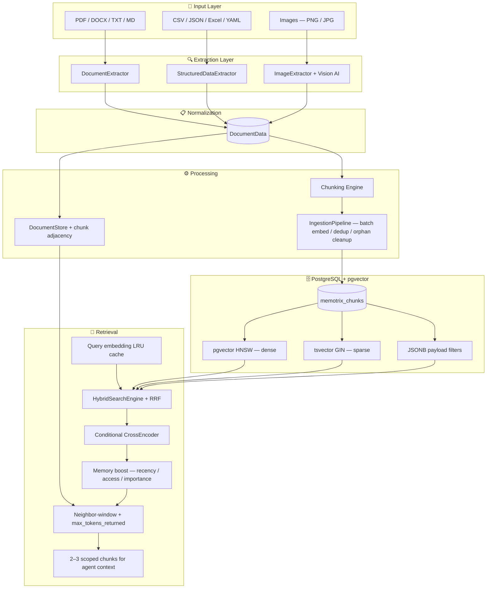

### Layer Responsibilities

| Layer | Modules | Responsibility |
|---|---|---|
| **File types** | `memotrix.filetypes` | Parse raw files into structured content |
| **Utils** | `memotrix.utils` | Shared models, document builder, AI integration |
| **Processes** | `memotrix.processes` | Chunking, ingestion, retrieval, document store, memory scoring |
| **Vector DB** | `memotrix.vectorDB` | PostgreSQL indexes, hybrid search, embedding defaults |
| **Services** | `memotrix.services` | AI description helpers |
| **Eval** | `tests/` | Fixture corpus, eval set, harness (Recall@5 / MRR / latency) |

---

## 3. End-to-End Pipeline

### Ingestion Flow

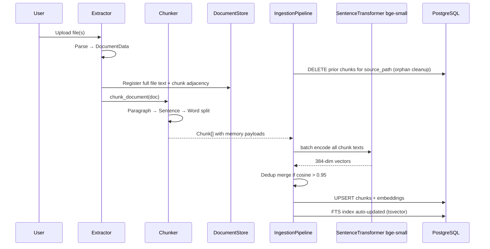

### Retrieval Flow

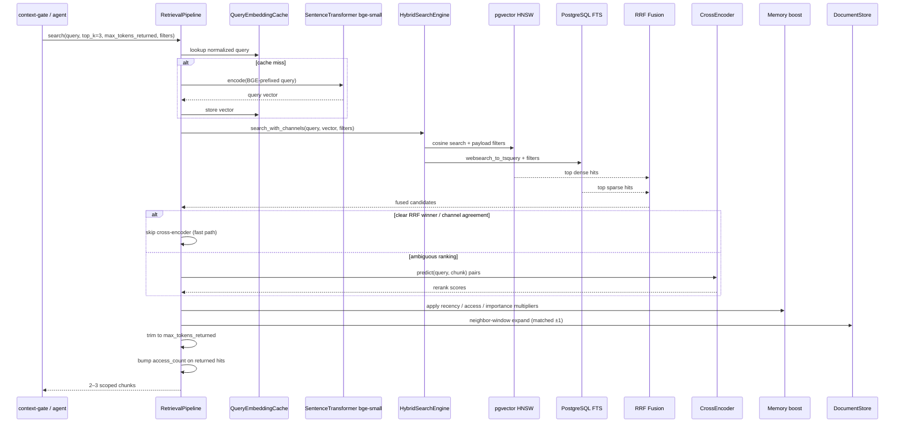

### Retrieval Funnel (Visual)

```
User / Agent Query
    │
    ▼
┌─────────────────────────────────────────────────────────┐
│  Stage 1 — Query Embedding (+ LRU cache)                │
│  Model: BAAI/bge-small-en-v1.5 (384 dimensions)         │
│  Prefix: "Represent this sentence for searching…"       │
└───────────────────────────┬─────────────────────────────┘
                            ▼
┌─────────────────────────────────────────────────────────┐
│  Stage 2 — Hybrid Candidate Retrieval (top ~20–50)      │
│  Optional filters: session_id, memory_type, …           │
│  ┌─────────────────────┐  ┌─────────────────────────┐ │
│  │ Dense: pgvector HNSW │  │ Sparse: PostgreSQL FTS  │ │
│  │ Cosine similarity    │  │ ts_rank_cd + GIN index  │ │
│  └──────────┬──────────┘  └────────────┬────────────┘ │
│             └──────────┬───────────────┘              │
│                        ▼                              │
│              Reciprocal Rank Fusion (k=60)            │
└───────────────────────────┬─────────────────────────────┘
                            ▼
┌─────────────────────────────────────────────────────────┐
│  Stage 3 — Conditional Cross-Encoder Reranking          │
│  Model: cross-encoder/ms-marco-MiniLM-L-6-v2           │
│  Skip when RRF margin is clear or dense+sparse agree    │
└───────────────────────────┬─────────────────────────────┘
                            ▼
┌─────────────────────────────────────────────────────────┐
│  Stage 4 — Memory boost                                 │
│  Soft multipliers: recency, access_count, importance    │
└───────────────────────────┬─────────────────────────────┘
                            ▼
┌─────────────────────────────────────────────────────────┐
│  Stage 5 — Neighbor-window expansion + token budget     │
│  matched ±1 chunk (same section); default max 800 tokens│
│  Legacy full-file expansion still available if opted in │
└───────────────────────────┬─────────────────────────────┘
                            ▼
                     Final top-k (default 3) results
```

---

## 4. Project Structure

```
memory/
├── README.md                 ← SDK install + compose API
├── Documentation.md          ← This file
├── pyproject.toml            ← pip package `memotrix` + extras
├── examples/                 ← 01_in_memory, 02_files_postgres, 03_agent_loop
├── docker-compose.yml        ← PostgreSQL + pgvector container
│
├── src/memotrix/
│   ├── memory.py             ← Public Memory facade (add / add_text / search / delete)
│   ├── config.py             ← MemoryConfig (no silent DSN / model / dim)
│   ├── embeddings.py         ← Embeddings ABC, HuggingFace, OpenAI, Fake
│   ├── vectorstores.py       ← InMemoryStore / PostgresStore
│   ├── api.py                ← build_retrieval_stack + AI providers
│   ├── filetypes/            ← Wired extractors (PDF, Office, HTML, tabular, images, video, audio, code, SCORM)
│   ├── processes/
│   │   ├── chunking.py       ← Hierarchical text chunking (honors MemoryConfig.chunking)
│   │   ├── ingestion.py      ← Batch embed + dedup + orphan cleanup
│   │   ├── retrieval.py      ← Search + conditional rerank + neighbor expand
│   │   ├── document_store.py ← Chunk adjacency; rehydrated from store payloads
│   │   └── memory_scoring.py ← Recency / access / importance multipliers
│   └── vectorDB/
│       ├── postgres_store.py ← pgvector + FTS + payload filters
│       ├── hybrid.py         ← RRF fusion
│       ├── hnsw_index.py     ← In-memory HNSW
│       └── sparse_index.py   ← In-memory BM25
│
└── tests/
    ├── eval_set.jsonl
    ├── eval_harness.py
    ├── test_memory_sdk.py    ← Lifecycle + rehydrate + extract hook
    └── fixtures/agent_memory/
```
```

### Module Quick-Reference Table

| File | Class / Function | Purpose |
|---|---|---|
| `processes/chunking.py` | `chunk_document()`, `chunk_text()` | Split documents into indexable chunks |
| `processes/ingestion.py` | `IngestionPipeline`, `ingest_many()` | Batch embed, dedup, orphan cleanup, index write |
| `processes/retrieval.py` | `RetrievalPipeline.search()` | Hybrid search, conditional rerank, neighbor expand, token budget |
| `processes/document_store.py` | `DocumentStore` | Full-file text + chunk adjacency for neighbor windows |
| `processes/memory_scoring.py` | `memory_score_multiplier()`, `bump_access()` | Agent-memory ranking helpers |
| `vectorDB/embeddings.py` | `QueryEmbeddingCache` | BGE query prefix, LRU cache (no silent model/dim defaults) |
| `vectorDB/postgres_store.py` | `PostgresChunkStore`, `PgDenseIndex`, `PgSparseIndex` | Production vector + FTS + filters |
| `vectorDB/hybrid.py` | `HybridSearchEngine`, `search_with_channels()` | Merge dense + sparse; expose channel agreement |
| `vectorDB/config.py` | `get_database_url()` | Load DB credentials from `.env` |
| `filetypes/structuredData/csv.py` | `CSVExtractor` | Row-batch text for searchable CSV cells |
| `utils/outputSturcture.py` | `build_document()` | Normalize extracted text → `DocumentData` |
| `utils/ai_integration.py` | `AIModelRouter`, `describe_image()` | Multi-provider AI for captions |

---

## 5. Algorithms Reference

### 5.1 Hierarchical Chunking

**Location:** `src/processes/chunking.py`

```mermaid
flowchart TD
    A[Raw section text] --> B{Split into paragraphs}
    B --> C{Paragraph ≤ limit + slack?}
    C -->|Yes| D[Pack paragraphs into chunk]
    C -->|No| E{Split into sentences}
    E --> F{Sentence ≤ limit + slack?}
    F -->|Yes| G[Pack sentences into chunk]
    F -->|No| H{Split into words}
    H --> I[Pack words — never break mid-word]
    D --> J[Apply overlap from previous chunk]
    G --> J
    I --> J
    J --> K[Output Chunk[]]
```

| Parameter | Default | What it does | Why we use it |
|---|---|---|---|
| `CHUNK_SIZE` | `500` chars | Target chunk length | Fits embedding model context; balances precision vs. recall |
| `CHUNK_OVERLAP` | `50` chars | Shared text between adjacent chunks | Prevents losing meaning at chunk boundaries |
| `PARAGRAPH_SLACK` | `20%` | Allow whole paragraph if slightly over limit | Keeps semantic units intact |
| `SENTENCE_SLACK` | `15%` | Same for sentences | Avoids mid-sentence cuts |
| `WORD_SLACK` | `10%` | Same for word groups | Last resort before splitting; never breaks a word |
| Chunk ID | SHA-256 | `hash(text + filename)` | Deterministic, idempotent upserts in PostgreSQL |

**Splitting hierarchy (never break inner unit):**

| Level | Separator | Fallback |
|---|---|---|
| 1 — Paragraph | `\n\n` | → Sentences |
| 2 — Sentence | `. ! ? …` + whitespace | → Words |
| 3 — Word | Whitespace only | Never split further |

**Chunk types produced:**

| Type | Source | Indexed text |
|---|---|---|
| `text` | `doc.sections[]` | Section content splits |
| `table` | `doc.tables[]` | `"Table containing columns: col1, col2..."` |
| `image` | `doc.images[]` | AI-generated description or tags |

---

### 5.2 Dense Embeddings (Semantic Search)

| Property | Value |
|---|---|
| **Model** | Caller-supplied (example: `BAAI/bge-small-en-v1.5` via `HuggingFaceEmbeddings`) |
| **Previous** | `all-MiniLM-L6-v2` (kept only as historical baseline in eval) |
| **Dimensions** | Inferred from the embedding model (`embeddings.dimension`) |
| **Query prefix** | `Represent this sentence for searching relevant passages: ` (BGE asymmetric) |
| **Used in** | `ingestion.py` (indexing), `retrieval.py` (query encoding) |
| **Defaults module** | none — `vectorDB/embeddings.py` has no silent model/dim constants |
| **Storage** | PostgreSQL `vector({dim})` column via pgvector |
| **Index type** | HNSW with `vector_cosine_ops` |
| **Similarity** | `1 - (embedding <=> query_vector)` (cosine distance) |

**Why a small BGE model is a common choice**

| Reason | Detail |
|---|---|
| Quality | Stronger retrieval than MiniLM at a small dim footprint |
| Schema | Table width follows `embeddings.dimension`; changing models may need a new table |
| Speed | Still small / CPU-friendly for agent-loop calls |
| Ecosystem | Native SentenceTransformers integration |

---

### 5.3 Sparse Search (Keyword / Full-Text)

| Property | Value |
|---|---|
| **Engine** | PostgreSQL Full-Text Search (FTS) |
| **Column** | `search_vector tsvector` (auto-generated) |
| **Generation** | `to_tsvector('english', chunk_text)` |
| **Index** | GIN on `search_vector` |
| **Query parser** | `websearch_to_tsquery('english', query)` |
| **Scoring** | `ts_rank_cd(search_vector, query)` |

**Why PostgreSQL FTS instead of BM25 in memory?**

| Reason | Detail |
|---|---|
| Persistence | Survives restarts; no separate search engine |
| Unified DB | Vectors + keywords + JSONB payloads in one place |
| Natural queries | `websearch_to_tsquery` supports quoted phrases, OR, etc. |
| Production-ready | Battle-tested at scale |

> **Legacy:** `BM25SparseIndex` in `sparse_index.py` (rank_bm25) exists for local dev without Postgres.

---

### 5.4 Hybrid Search — Reciprocal Rank Fusion (RRF)

**Location:** `src/vectorDB/hybrid.py`

**Formula:**

```
RRF_score(document) = Σ  1 / (k + rank_i)
                      i ∈ {dense_rank, sparse_rank}

Default k = 60
```

**Visual example:**

| Chunk | Dense Rank | Sparse Rank | RRF Score |
|---|---|---|---|
| Chunk A | 1 | 3 | 1/61 + 1/63 = **0.0323** |
| Chunk B | 2 | 1 | 1/62 + 1/61 = **0.0325** ← wins |
| Chunk C | 5 | — | 1/65 = 0.0154 |

| Parameter | Value | Why |
|---|---|---|
| `fusion_k` | `60` | Standard smoothing constant from IR literature |
| `fetch_k` | `top_k × 5` | Fetch extra candidates before fusion for better overlap |

**Why RRF?**

| Reason | Detail |
|---|---|
| Scale-invariant | Dense cosine scores and FTS ranks are on different scales — RRF ignores raw scores |
| Simple & effective | No tuning of score weights needed |
| Proven | Used in production RAG systems (e.g. Elasticsearch hybrid, Azure AI Search) |

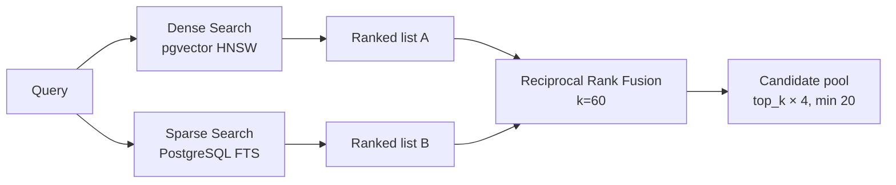

---

### 5.5 Conditional Cross-Encoder Reranking

| Property | Value |
|---|---|
| **Model** | `cross-encoder/ms-marco-MiniLM-L-6-v2` |
| **Input** | `(query, chunk_text)` pairs |
| **Output** | Relevance score per pair |
| **Location** | `src/processes/retrieval.py` |
| **Default top-k** | **3** final results (agent context budget) |
| **Fast path** | Skip rerank when RRF margin ≥ `RERANK_SKIP_MARGIN` (0.015) or dense+sparse agree on top-1 with margin ≥ `RERANK_AGREE_MARGIN` (0.008) |

**Bi-encoder vs Cross-encoder:**

| | Bi-encoder (retrieval) | Cross-encoder (rerank) |
|---|---|---|
| Speed | Fast — embed once, compare vectors | Slower — joint encoding per pair |
| Accuracy | Good recall | High precision |
| Used for | Stage 1–2: find candidates | Stage 3: rescore when ranking is ambiguous |
| Why both | Fast wide search + precise final ranking when needed |

Agent loops call memory constantly — always running the cross-encoder wastes latency when hybrid already has a clear winner.

---

### 5.6 Neighbor-Window Expansion + Token Budget

**Location:** `src/processes/document_store.py` + `retrieval.py`

Default expansion mode is **`neighbors`** (agent-appropriate). Full-file expansion is legacy / opt-in via `expand_mode="full_file"` or `expand_top_file_content=True`.

| Field | Content |
|---|---|
| `matched_chunk` | The exact chunk that scored |
| `chunk_text` / `content` | Matched chunk ± `neighbor_window` (default 1) from the **same section** |
| `neighbor_chunk_indices` | Indices included in the window |
| `tokens_estimate` | Approx tokens (`chars / 4`) |
| Lookup key | `(source_path, section_title, chunk_index)` adjacency in `DocumentStore` |

**API (agent-facing):**

```python
results = pipeline.search(
    query,
    top_k=3,
    max_tokens_returned=800,   # remaining agent context window
    session_id="proj-42",      # optional metadata filter
    memory_type="episodic",    # optional metadata filter
)
```

| Reason | Detail |
|---|---|
| Token budget | Agents cannot dump full files into every reasoning step |
| Precision | Chunk finds the needle; neighbors keep local context |
| Controllable | `max_tokens_returned` lets context-gate pass remaining window size |

---

### 5.7 Memory-Specific Ranking (Phase 4)

**Location:** `src/processes/memory_scoring.py`

After relevance scoring, each candidate is multiplied by a soft boost:

```
multiplier = 1
           + 0.15 * recency_exp(-age_days / 30)
           + 0.05 * log1p(access_count)
           + 0.08 * log1p(importance)
```

| Signal | Source | Effect |
|---|---|---|
| **Recency** | `last_accessed` / `created_at` | Fresh facts outrank stale ones on ties |
| **Access count** | Incremented when a chunk is returned | Frequently useful memories rise (MemGPT-style) |
| **Importance** | Starts at 1; +1 on near-dupe merge | Repeatedly logged facts gain weight |

Payload fields stamped on ingest: `created_at`, `ingested_at`, `last_accessed`, `access_count`, `importance`, `memory_type`.

---

### 5.8 Deduplication on Ingest

**Location:** `src/processes/ingestion.py`  
**Threshold:** `DEDUP_COSINE_THRESHOLD = 0.95` (`embeddings.py`)

Before inserting a new dense chunk, search for the nearest existing vector. If cosine similarity > 0.95:

1. Do **not** insert a duplicate
2. Merge into the existing chunk (`importance += 1`, keep longer text, refresh metadata)
3. Prevents agent memory from drowning in near-copies (“user prefers dark mode” × 5)

---

### 5.9 Orphan Cleanup + Batch Ingest

| Feature | Behavior |
|---|---|
| **Orphan cleanup** | `delete_by_source_path(source_path)` before re-insert so stale chunks cannot surface |
| **`ingest_many()`** | Collects chunks across many files, **one batched encode**, then writes indexes |
| **CSV row batches** | `CSVExtractor` embeds 25-row batches with headers repeated (not headers-only) |

---

### 5.10 Query Embedding Cache

**Location:** `src/vectorDB/embeddings.py` → `QueryEmbeddingCache`

| Property | Value |
|---|---|
| Type | Session-scoped LRU |
| Default size | 256 entries |
| Key | SHA-256 of `model_name + normalized query` |
| Why | Agents often repeat near-identical memory queries in a loop |

---

### 5.11 AI Vision Captioning (Images)

**Location:** `src/utils/ai_integration.py`, `src/filetypes/images/images.py`

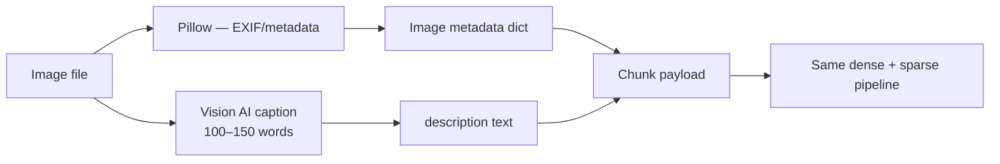

**Provider priority:**

| Priority | Env variable | Provider |
|---|---|---|
| 1 | `OPENROUTER_API_KEY` | OpenRouter (any vision model) |
| 2 | `OPENAI_API_KEY` | OpenAI GPT-4 Vision |
| 3 | `GOOGLE_API_KEY` | Google Gemini |
| 4 | (none) | Local fallback stub |

**Why caption images as text?**

Text embedders cannot read pixels. Converting images to captions makes them searchable in the same vector + FTS pipeline as documents.

---

## 6. Configuration Reference

### 6.1 Environment Variables (`.env`)

> `.env` is gitignored. Copy the template below and fill in your values.

```env
# ── PostgreSQL (primary vector store) ──────────────────────
POSTGRES_HOST=localhost
POSTGRES_PORT=5432
POSTGRES_USER=postgres
POSTGRES_PASSWORD=<your_password>
POSTGRES_DB=memotrix

# Optional single URL (overrides POSTGRES_* if POSTGRES_USER unset):
# DATABASE_URL=postgresql://postgres:<password>@localhost:5432/memotrix

# ── AI Providers (optional — needed for image captioning) ─
OPENROUTER_API_KEY=<key>
OPENROUTER_MODEL=<model_name>          # optional

OPENAI_API_KEY=<key>

GOOGLE_API_KEY=<key>
GOOGLE_MODEL=gemini-2.5-flash          # optional
```

### 6.2 Config Loading Priority

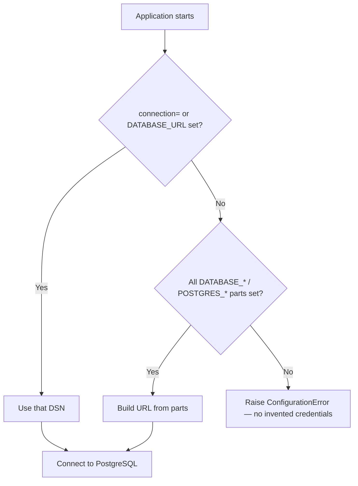

**Location:** `src/memotrix/config.py` → `resolve_database_url()` (never falls back to a baked-in password).

### 6.3 Docker Compose

| Setting | Value | Why |
|---|---|---|
| Image | `pgvector/pgvector:pg16` | Official Postgres 16 + pgvector extension pre-installed |
| Container | `memotrix-postgres` | Named container for easy management |
| Port | `5432:5432` | Standard Postgres port |
| Database | `memotrix` | Dedicated DB for this project |
| Volume | `memotrix_pg_data` | Data persists across container restarts |
| Healthcheck | `pg_isready` every 5s | Ensures DB is ready before app connects |

```bash
# Start
docker compose up -d

# Stop
docker compose down

# Stop + delete data
docker compose down -v
```

### 6.4 Code Constants

| Location | Constant | Default | Purpose |
|---|---|---|---|
| `chunking.py` | `CHUNK_SIZE` | 500 | Target chunk character count |
| `chunking.py` | `CHUNK_OVERLAP` | 50 | Overlap between chunks |
| `chunking.py` | `PARAGRAPH_SLACK` | 0.2 | Keep near-limit paragraphs whole |
| `chunking.py` | `SENTENCE_SLACK` | 0.15 | Keep near-limit sentences whole |
| `chunking.py` | `WORD_SLACK` | 0.1 | Keep near-limit word groups whole |
| `embeddings.py` | *(none)* | Callers pass an explicit model; dimension comes from the model |
| `embeddings.py` | `DEDUP_COSINE_THRESHOLD` | 0.95 | Near-dupe merge threshold |
| `embeddings.py` | `RERANK_SKIP_MARGIN` | 0.015 | Skip cross-encoder if RRF gap ≥ this |
| `embeddings.py` | `RERANK_AGREE_MARGIN` | 0.008 | Skip when channels agree + margin |
| `csv.py` | `ROWS_PER_BATCH` | 8 | CSV rows per metadata batch (chunking also packs 8 rows) |
| `postgres_store.py` | `DEFAULT_TABLE` | `memotrix_chunks` | PostgreSQL table name |
| `hybrid.py` | `fusion_k` | 60 | RRF smoothing constant |
| `hybrid.py` | `fetch_k` | `top_k × 5` | Candidates fetched per index |
| `retrieval.py` | `DEFAULT_TOP_K` | 3 | Final results for agent context |
| `retrieval.py` | `DEFAULT_MAX_TOKENS` | 800 | Default token budget for returned text |
| `retrieval.py` | `DEFAULT_NEIGHBOR_WINDOW` | 1 | Prev/next chunks in same section |
| `retrieval.py` | `expand_mode` | `neighbors` | `neighbors` \| `none` \| `full_file` |
| `retrieval.py` | candidate pool | `max(top_k × 4, 20)` | Candidates before rerank |
| `ingestion.py` | `enable_dedup` | `True` | Merge near-duplicate memories |
| `hnsw_index.py` *(dev/eval)* | `M` | 16 | HNSW graph connectivity |
| `hnsw_index.py` *(dev/eval)* | `ef_construction` | 200 | HNSW build-time search depth |
| `hnsw_index.py` *(dev/eval)* | `ef` | 50 | HNSW query-time search depth |

---

## 7. Database Schema

### Table: `memotrix_chunks`

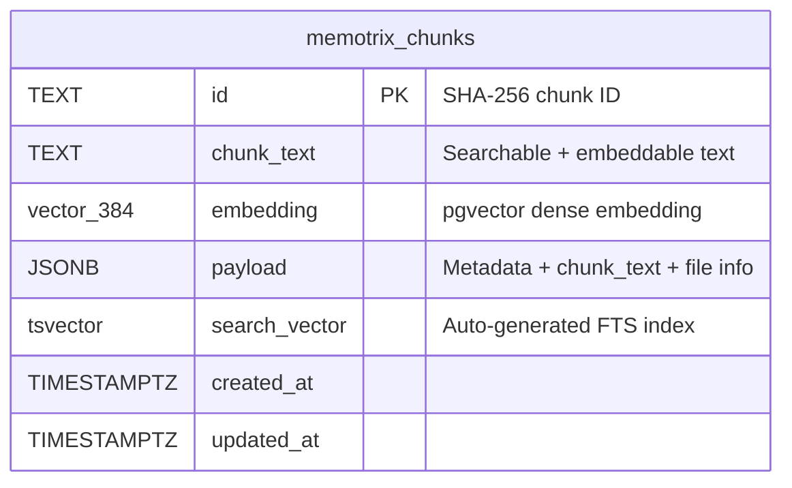

| Column | Type | Description |
|---|---|---|
| `id` | `TEXT PRIMARY KEY` | SHA-256 hash of chunk text + filename |
| `chunk_text` | `TEXT NOT NULL` | Raw text used for embedding and FTS |
| `embedding` | `vector(384)` | Dense semantic vector (nullable until dense index write) |
| `payload` | `JSONB` | Full metadata: filename, source_path, type, section_title, memory fields, etc. |
| `search_vector` | `tsvector` (generated) | Auto-built from `chunk_text` for keyword search |
| `created_at` | `TIMESTAMPTZ` | First insert time |
| `updated_at` | `TIMESTAMPTZ` | Last upsert time |

### Indexes

| Index | Type | Column | Why |
|---|---|---|---|
| `memotrix_chunks_embedding_hnsw_idx` | HNSW | `embedding vector_cosine_ops` | Fast approximate nearest-neighbor vector search |
| `memotrix_chunks_search_gin_idx` | GIN | `search_vector` | Fast full-text keyword search |
| `memotrix_chunks_payload_gin_idx` | GIN | `payload jsonb_path_ops` | Fast metadata filters (`session_id`, `memory_type`, …) |

### One-Time Local Postgres Setup (without Docker)

```sql
CREATE DATABASE memotrix;
\c memotrix
CREATE EXTENSION IF NOT EXISTS vector;
```

---

## 8. Data Models

### DocumentData

The universal container for all extracted file content.

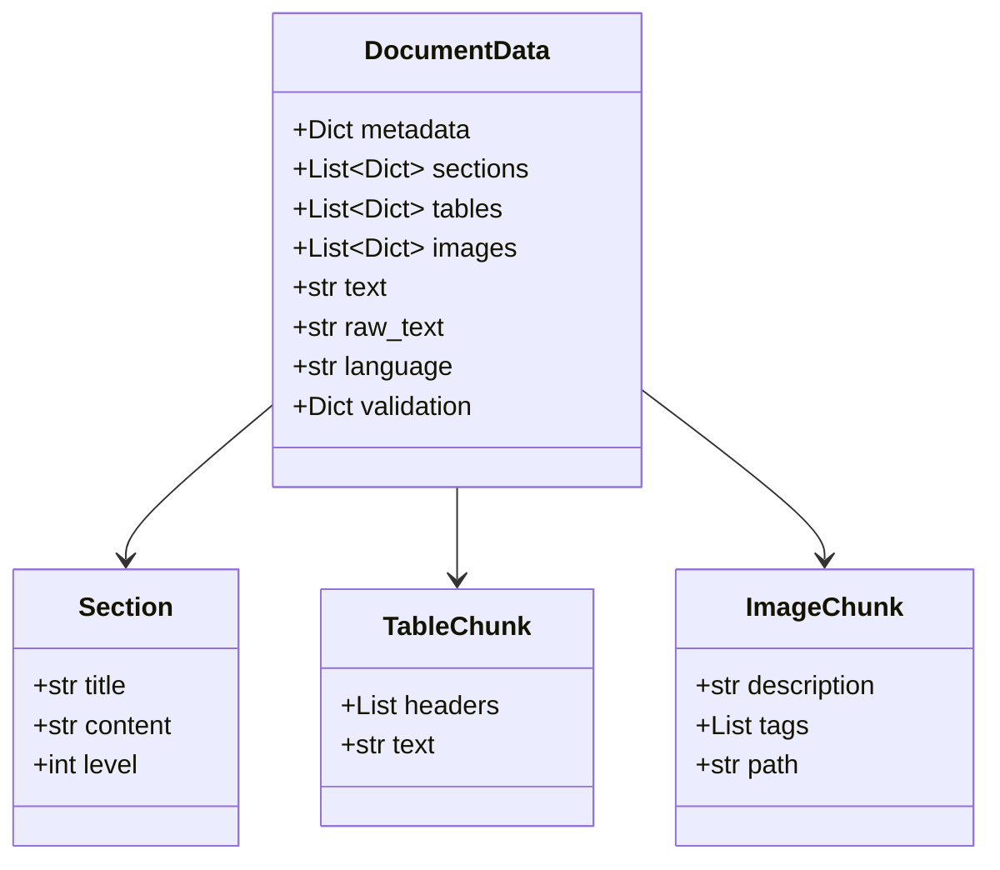

| Field | Type | Description |
|---|---|---|
| `metadata` | `dict` | `filename`, `extension`, `size`, timestamps, `source_path`, `file_type` |
| `sections` | `list[dict]` | `[{title, content, level}]` — heading-aware text blocks |
| `tables` | `list[dict]` | `[{headers, text}]` — tabular data summaries |
| `images` | `list[dict]` | `[{description, tags, path}]` — image metadata + AI caption |
| `text` | `str` | Full normalized document text |
| `validation` | `dict` | `word_count`, `char_count`, `has_tables`, `has_images` |

### Chunk

| Field | Type | Description |
|---|---|---|
| `id` | `str` | SHA-256 deterministic ID |
| `text` | `str` | Text sent to embedder and FTS |
| `is_dense_indexable` | `bool` | Include in pgvector index |
| `is_sparse_indexable` | `bool` | Include in FTS index |
| `payload` | `dict` | Metadata copied to PostgreSQL JSONB |

### Payload Fields by Chunk Type

| `type` | Key payload fields |
|---|---|
| `text` | `filename`, `source_path`, `section_title`, `chunk_index`, `chunk_text` |
| `table` | `filename`, `source_path`, `table_index`, `chunk_text` |
| `image` | `filename`, `source_path`, `image_index`, `image_path`, `tags`, `chunk_text` |

### Agent-memory payload fields (all chunk types)

| Field | Description |
|---|---|
| `memory_type` | `semantic` \| `episodic` \| `procedural` (filterable) |
| `session_id` | Optional project / session scope (filterable) |
| `created_at` / `ingested_at` | First seen timestamps |
| `last_accessed` | Updated when the chunk is returned from search |
| `access_count` | How often the chunk has been retrieved |
| `importance` | Starts at 1; incremented on near-dupe merge |

---

## 9. Supported File Types

### Status Matrix

| Category | Extension | Extractor | Backend | Status |
|---|---|---|---|---|
| **PDF** | `.pdf` | `PDFExtractor` | PyMuPDF (`fitz`) | ✅ Ready |
| **Word** | `.docx` | `DOCXExtractor` | `python-docx` | ✅ Ready |
| **PowerPoint** | `.pptx` | `PPTXExtractor` | `python-pptx` | ✅ Ready |
| **Plain text** | `.txt` | `TXTExtractor` | Native read | ✅ Ready |
| **Markdown** | `.md`, `.markdown` | `MarkdownExtractor` | Native read | ✅ Ready |
| **CSV** | `.csv` | `CSVExtractor` | `csv` module (row batches + headers) | ✅ Ready |
| **Excel** | `.xlsx` | `ExcelExtractor` | `openpyxl` (`.xls` is rejected; convert to `.xlsx`) | ✅ Ready |
| **JSON** | `.json` | `JSONExtractor` | `json` module | ✅ Ready |
| **YAML** | `.yaml`, `.yml` | `YAMLExtractor` | `PyYAML` | ✅ Ready |
| **XML** | `.xml` | `XMLExtractor` | `xml.etree` | ✅ Ready |
| **SQL** | `.sql` | `SQLExtractor` | Raw file read | ✅ Ready |
| **Images** | `.png`, `.jpg`, `.jpeg`, `.webp`, `.bmp`, `.gif`, `.tiff` | `ImageExtractor` | Pillow + Vision AI | Ready |
| **Audio** | `.mp3`, `.wav`, `.aac`, `.m4a`, `.ogg`, `.flac`, `.wma` | `AudioExtractor` | faster-whisper (`[audio]`) | Ready |
| **Video** | `.mp4`, `.mov`, `.mkv`, `.webm`, … | `VideoExtractor` | ffmpeg + Whisper | Ready |
| **Source code** | `.py`, `.js`, `.ts`, `.java`, `.cpp`, `.go`, `.rs` | `ProgrammingFileExtractor` | function/class chunks | Ready |
| **Web / HTML** | `.html`, `.htm` | `HTMLExtractor` | BeautifulSoup | Ready |
| **EPUB** | `.epub` | `EPUBExtractor` | zip + HTML text | Ready |
| **SCORM** | `.scorm`, or `.zip` with `imsmanifest.xml` | `ScormExtractor` | Generic zips are unsupported | Ready |
| **Knowledge graphs** | `.ttl`, `.nt`, `.rdf`, `.owl`, `.jsonld`, `.graphml` | `KnowledgeGraphExtractor` | rdflib / N-Triples / GraphML | Ready |
| **GeoJSON** | `.geojson`, sniffed `.json` | `GeoJSONExtractor` | stdlib JSON | Ready |
| **FHIR** | sniffed `.json` `resourceType` | `FHIRExtractor` | resource narratives | Ready |
| **Email** | `.eml`, `.mbox` | `EmailExtractor` | stdlib email | Ready |
| **Chat** | JSON / JSONL / WhatsApp `.txt` | `ChatExtractor` | message lines | Ready |
| **Logs** | `.log` | `LogExtractor` | timestamp windows | Ready |

### Extraction Strategy by Type

| File type | What gets embedded | Why this approach |
|---|---|---|
| PDF / DOCX / TXT / MD | Full text + embedded image OCR captions | Text + figures searchable |
| PDF (scanned / image-only pages) | Full-page render → vision OCR + caption | Pages with almost no extractable text |
| PPTX | Slide text + picture OCR captions | Images between bullets stay retrievable |
| CSV | Row batches (25 rows) with headers repeated | Cell values are retrieval-visible (like Excel) |
| JSON / YAML / XML | Pretty-printed structure | Preserves hierarchy as searchable text |
| Excel | All sheet rows as pipe-separated text | Makes tabular data keyword-findable |
| Images | AI-generated caption (100–150 words) | Makes visual content text-searchable |
| Knowledge graphs | Triple sentences (`Alice works_at Acme.`) | Facts retrieve without a graph DB |
| GeoJSON | Named features + coordinates as text | Marine / maps without a GIS index |
| FHIR JSON | Patient / Observation / Condition narratives | Clinical memory without DICOM |
| Email / chat / logs | Message and time windows | Episodic ops / education / audit memory |
| EPUB | Spine-ordered chapter text | Course books and long-form reading |

---

## 10. Setup & Installation

### Prerequisites

| Tool | Version | Why needed |
|---|---|---|
| Python | 3.10+ | Runtime |
| PostgreSQL 16 + pgvector | Latest | Vector + FTS storage |
| Docker Desktop | Latest | Easiest way to run Postgres locally |
| Git | Any | Clone the repo |

### Step-by-Step

```bash
# Library install
pip install -e ./memory[postgres,local,embeddings,extractors,openai]

# Or from environment after setting EMBEDDING_MODEL (and DATABASE_URL for postgres)
python -c "from memotrix import Memory; print(Memory.from_env())"
```

### Architecture After Setup

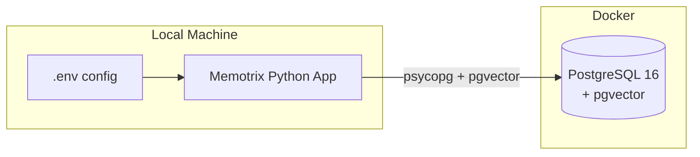

---

## 11. Eval Harness & Tests

Quality is **measured**, not assumed. The harness is the before/after gate for every retrieval change.

### Eval harness

| Artifact | Path |
|---|---|
| Ground-truth queries | `tests/eval_set.jsonl` (~45 agent-style queries) |
| Fixture corpus | `tests/fixtures/agent_memory/` |
| Runner | `tests/eval_harness.py` |
| Saved results | `tests/eval_results/baseline_phase0.json`, `post_upgrade.json` |

**Metrics:** Recall@5, MRR, mean / p50 / p95 latency per query.

```bash
# Full eval (uses BAAI/bge-small-en-v1.5 by default)
python -m tests.eval_harness --out tests/eval_results/post_upgrade.json

# Ablations
python -m tests.eval_harness --expand-mode none
python -m tests.eval_harness --legacy-full-file
python -m tests.eval_harness --embedding-model all-MiniLM-L6-v2
```

Harness notes:

- Uses in-memory HNSW + BM25 (no Postgres required)
- Disables conditional-rerank skip + memory boost so quality numbers stay comparable across models
- Production agent calls keep those optimizations **on**

### Unit tests

```bash
python -m pytest tests/test_neighbor_expansion.py tests/test_phase_upgrades.py -q
```

Covers neighbor windows, CSV row batches, payload filters, recency boost, query cache, orphan cleanup, and conditional-rerank skip logic.

### Manual integration test (optional, local)

**Script:** `tests/test_file_upload.py` (ad-hoc; may be gitignored)

| Command | What it does |
|---|---|
| `python tests/test_file_upload.py --file "./filesForTests/"` | Ingest test folder against Postgres |
| `python tests/test_file_upload.py --folder path/to/docs --reset-db` | Clear DB then ingest |

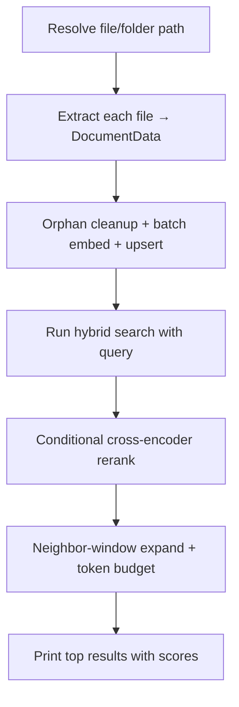

### Latest measured baseline

| Metric | Phase 0 (MiniLM) | Post-upgrade (bge-small) |
|---|---|---|
| Recall@5 | 0.978 | 0.978 |
| MRR | 0.923 | 0.923 |
| Misses | q31 | q31 |
| Embed model | all-MiniLM-L6-v2 | BAAI/bge-small-en-v1.5 |

Fixture corpus is small / near ceiling — expect larger gains on real agent-memory corpora. See `README.md`.
---

## 12. Dependencies

### Core (in `requirements.txt`)

| Package | Min version | Used for | Why |
|---|---|---|---|
| `psycopg[binary]` | 3.2.0 | PostgreSQL driver | Modern async-capable Postgres client |
| `pgvector` | 0.3.6 | Vector type in Python | Register `vector` type with psycopg |
| `python-dotenv` | 1.0.0 | Load `.env` | Keep secrets out of code |
| `sentence-transformers` | 3.0.0 | Embeddings + CrossEncoder | bge-small embedder + MS MARCO reranker |
| `hnswlib` | 0.8.0 | In-memory dense index | Eval harness / local dev without Postgres |
| `rank_bm25` | 0.2.2 | In-memory sparse index | Eval harness / local BM25 |

### Optional — Document Extractors

| Package | Required for |
|---|---|
| `pymupdf` | PDF extraction |
| `python-docx` | DOCX extraction |
| `python-pptx` | PPTX extraction |
| `openpyxl` | Excel extraction |
| `pyyaml` | YAML extraction |
| `pillow` | Image metadata |

### Optional — AI Providers

| Package | Required for |
|---|---|
| `openai` | OpenAI / OpenRouter API |
| `google-genai` | Google Gemini API |

### Install Everything

```bash
pip install -r requirements.txt
pip install pymupdf python-docx python-pptx openpyxl pyyaml pillow openai google-genai
```
---

## 13. Design Decisions (Why We Use Each Technology)

### Master Decision Table

| Technology | Used for | Why we chose it | Alternative considered |
|---|---|---|---|
| **PostgreSQL** | Primary database | Mature, ACID, JSONB, FTS built-in, one DB for everything | MongoDB, Elasticsearch |
| **pgvector** | Dense vector storage + HNSW | Native Postgres extension; no separate vector DB to operate | Pinecone, Weaviate, Qdrant |
| **PostgreSQL FTS** | Keyword / sparse search | Same DB as vectors; GIN indexes; no extra service | Elasticsearch, BM25 in-memory |
| **HNSW index** | Approximate nearest neighbor | O(log n) search; production-grade at scale | IVFFlat, brute-force |
| **RRF (k=60)** | Merge dense + sparse rankings | Score-scale invariant; proven in hybrid IR | Weighted sum, CombSUM |
| **BAAI/bge-small-en-v1.5** | Embedding model | Stronger retrieval than MiniLM at same 384-dim | MiniLM, nomic-embed, OpenAI ada |
| **Conditional CrossEncoder** | Final relevance scoring | High precision when needed; skippable for agent latency | Always-on rerank, LLM-as-reranker |
| **Hierarchical chunking** | Text splitting | Preserves semantic units; no broken sentences | Fixed-size split, LangChain splitter |
| **SHA-256 chunk IDs** | Idempotent upserts | Same content → same ID → safe re-ingestion | UUID random IDs |
| **Neighbor-window DocumentStore** | Context expansion | Agent token budgets; matched ± neighbors | Full-file dump into context |
| **Memory scoring** | Recency / access / importance | Agent memory, not generic RAG | Relevance-only ranking |
| **Dedup (cosine > 0.95)** | Ingest hygiene | Merge near-duplicate facts instead of drowning signal | Insert everything |
| **Query embedding LRU** | Repeated agent queries | Avoid re-encoding identical queries in a loop | Encode every call |
| **Eval harness** | Measured quality | Recall@5 / MRR / latency — not vibes | Ad-hoc manual checks |
| **SentenceTransformers** | Embedding + reranking | Single library for both models | HuggingFace transformers direct |
| **Vision AI captioning** | Image searchability | Text embedders can't read pixels | CLIP embeddings (separate index) |
| **python-dotenv** | Config management | Simple local dev; secrets in `.env` | Hardcoded config, Vault |
| **Docker Compose** | Local Postgres setup | One command to run pgvector Postgres | Manual Postgres install |
| **Abstract DenseIndex/SparseIndex** | Backend swap | Postgres prod vs in-memory eval/dev | Tightly coupled code |

### Dual-Representation Indexing — Why Both Dense and Sparse?

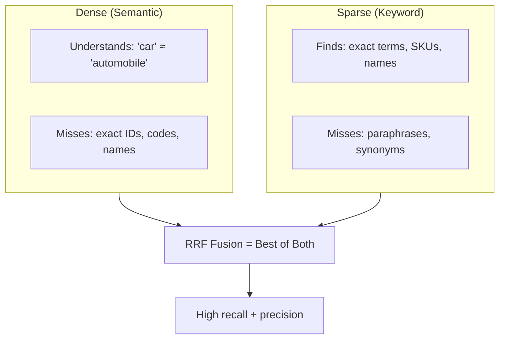

| Query type | Dense finds it? | Sparse finds it? | Hybrid finds it? |
|---|---|---|---|
| "What is hybrid search?" (semantic) | ✅ Yes | ⚠️ Maybe | ✅ Yes |
| "Error code TX-9921" (exact) | ❌ No | ✅ Yes | ✅ Yes |
| "automobile insurance" vs doc says "car insurance" | ✅ Yes | ❌ No | ✅ Yes |
| "TUG framework architecture" (mixed) | ✅ Yes | ✅ Yes | ✅ Best |

---

## 14. Roadmap & Planned File Types

Wired extractors are listed in §9. Remaining ideas (email/chat, logs, geospatial) are out of the SDK surface until implemented — there are no stub modules.

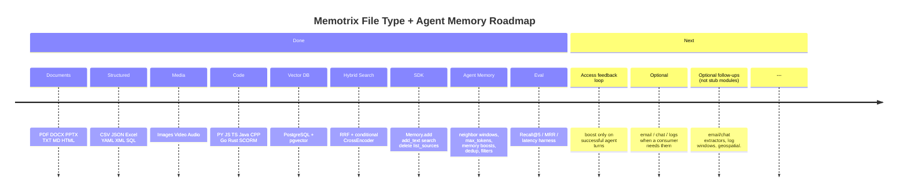
┌─────────────────────────────────────────────────────────────────┐
│                    MEMOTRIX QUICK REFERENCE                     │
├──────────────────┬──────────────────────────────────────────────┤
│ Embed model      │ BAAI/bge-small-en-v1.5 (384-dim)             │
│ Reranker         │ cross-encoder/ms-marco-MiniLM-L-6-v2         │
│                  │ (conditional skip for agent latency)         │
│ Vector store     │ PostgreSQL + pgvector (HNSW, cosine)         │
│ Keyword store    │ PostgreSQL FTS (tsvector + GIN)              │
│ Fusion           │ RRF, k=60                                    │
│ Chunk size       │ 500 chars, 50 overlap                        │
│ Default top_k    │ 3 (agent context budget)                     │
│ Expansion        │ Neighbor window (±1), max_tokens=800         │
│ Memory boosts    │ Recency + access_count + importance          │
│ Dedup            │ Cosine > 0.95 → merge                        │
│ Filters          │ session_id, memory_type                      │
│ DB table         │ memotrix_chunks                              │
│ Public API       │ Memory.add / add_text / search / delete      │
│ Config           │ MemoryConfig + EMBEDDING_MODEL / DATABASE_URL │
│ Start DB         │ docker compose up -d (memory/)               │
│ Run eval         │ python -m tests.eval_harness                 │
│ SDK docs         │ README.md                                    │
└──────────────────┴──────────────────────────────────────────────┘
```

---

*Last updated: July 2026 — agent-memory upgrades (Phases 0–6) reflected*
