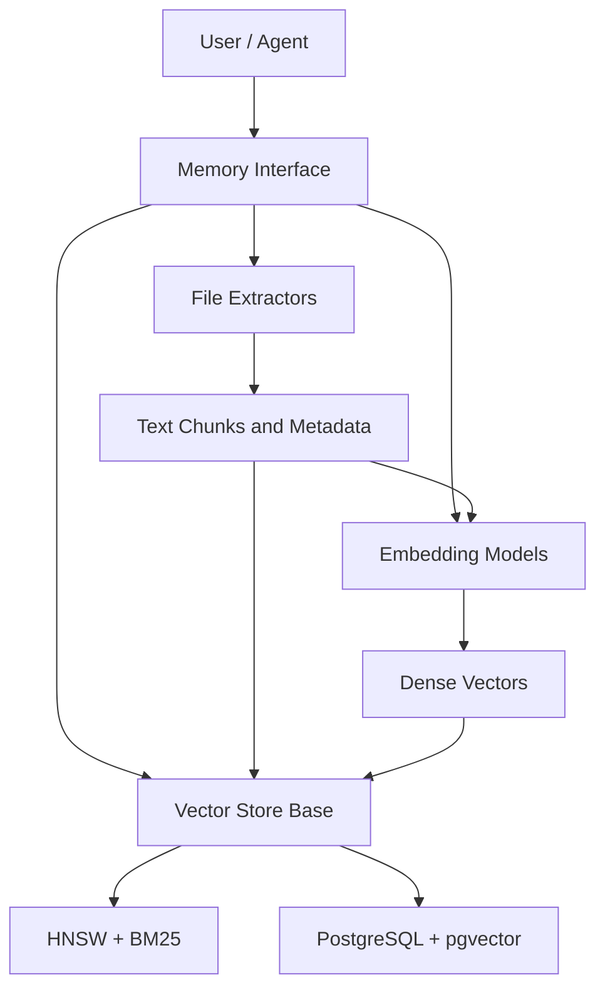
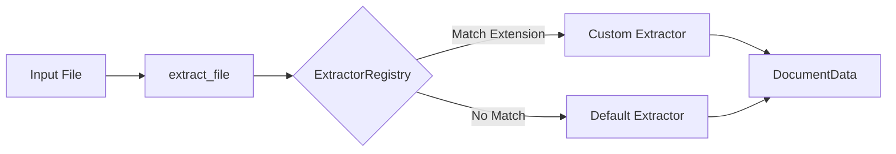
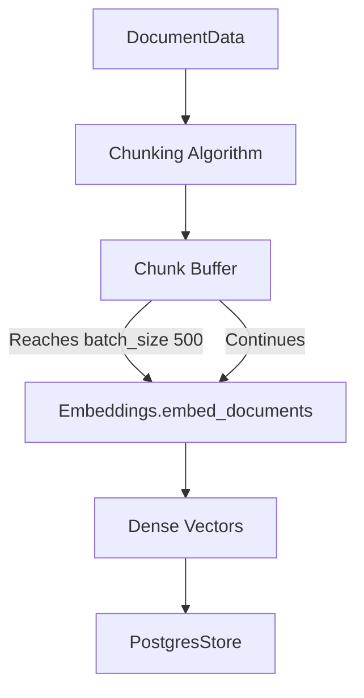

# System Architecture

## High-Level Architecture

The Memotrix architecture revolves around the `Memory` class, which acts as the orchestrator.

## Component Architecture

1. **`memotrix/api.py` / `memory.py`:** Exposes the public API (`Memory.add`, `Memory.add_text`, `Memory.search`).
2. **`memotrix/filetypes/`:** Contains the **Extractor Plugin Registry** (`registry.py`) and specific extractors for different file formats.
3. **`memotrix/embeddings.py`:** Contains abstract and concrete implementations for generating embeddings.
4. **`memotrix/vectorDB/`:** Contains the indexing logic (`hnsw_index.py`, `sparse_index.py`, `postgres_store.py`).
5. **`memotrix/processes/`:** Manages internal data flows like chunking and retrieval fusion.

## Detailed Flows

### 1. Extractor Plugin Registry
Adding a new file type no longer requires modifying the core SDK. Developers can register new extractors dynamically.

### 2. Ingestion Batching Pipeline
To prevent memory exhaustion and network rate limits, Memotrix chunks large documents and batches them before sending to the Embedding model.

## Design Philosophy
The system is built on dependency injection. The `Memory` instance doesn't hardcode how vectors are generated or stored; it accepts `embeddings` and `store` objects, making the framework highly extensible.
