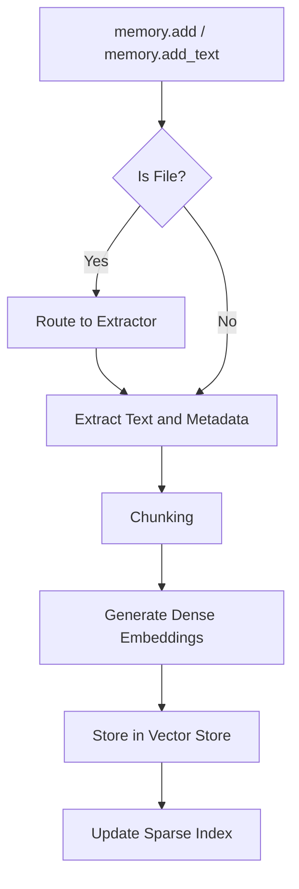
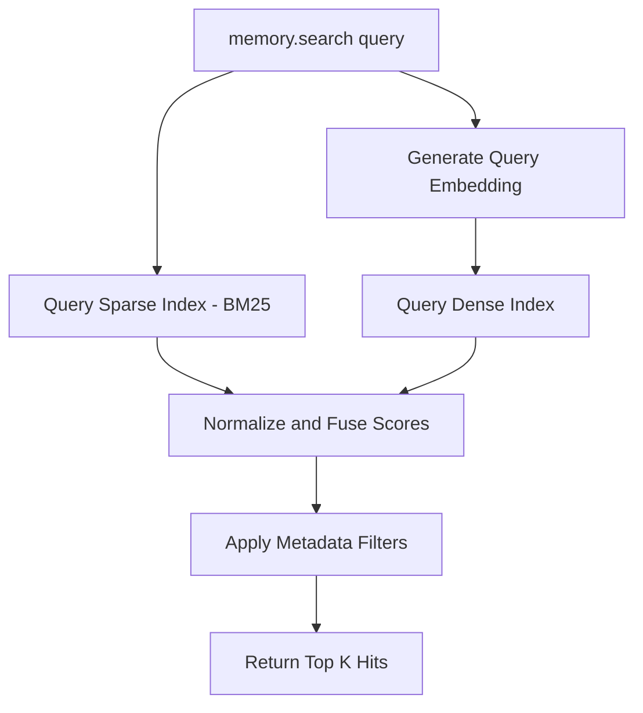

# Core Workflows

## Data Ingestion Workflow

## Retrieval Workflow

## Explanation
The ingestion workflow normalizes all input (whether raw text or complex files) into a standard chunk format. The retrieval workflow ensures that both keyword matches (sparse) and semantic meaning (dense) contribute to the final ranking, yielding more robust results than vector-search alone.
