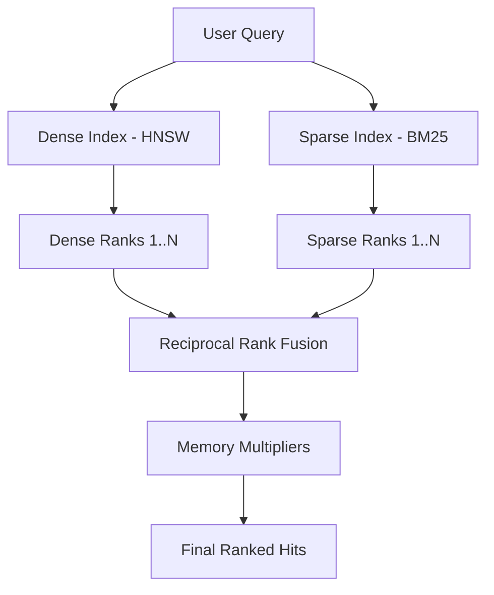

# AI & RAG Architecture

## Role in the RAG Pipeline
Memotrix functions as the **Retrieval** component in a Retrieval-Augmented Generation pipeline. It is not responsible for the final Generation step (calling the LLM chat completions endpoint to generate the answer).

## Embedding Flow
The `Embeddings` base class defines the interface. 
- **`HuggingFaceEmbeddings`**: Uses local models (e.g., `BAAI/bge-small-en-v1.5`) running via Sentence-Transformers. Ideal for privacy and cost-efficiency.
- **`OpenAIEmbeddings`**: Reaches out to the OpenAI API to generate embeddings.

## Context Construction
When `memory.search()` is called, Memotrix returns a list of `Hits`. Each hit contains:
- The chunk text.
- The associated metadata (`memory_type`, `session_id`, `source_id`).
- The fused relevance score.

The developer's Agent logic takes these texts and injects them into the prompt for the Generation LLM.

## Hybrid Scoring & Retrieval Flow
The hybrid nature is crucial for AI agents. An agent searching for "Error code 503 in system X" needs exact keyword matching for "503" and "system X", but semantic matching to understand it relates to "server downtime". The combination of HNSW and BM25 achieves this.

Memotrix uses **Reciprocal Rank Fusion (RRF)** to combine the results from the Dense and Sparse indexes.

### 1. Reciprocal Rank Fusion (RRF)
RRF calculates a new score for each chunk based on its rank in both indexes:
`RRF Score = 1 / (fusion_k + rank)`

### 2. Memory Boosts
After RRF fusion, Memotrix applies multipliers to the score based on:
- **Recency:** Newer chunks receive a slight boost.
- **Access Count:** Frequently retrieved chunks receive a boost.
- **Importance:** Chunks flagged during dedup receive a boost.
