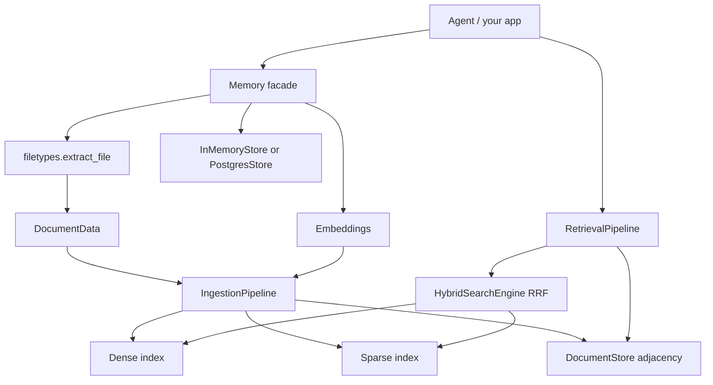

# Architecture

Public usage lives in this `docs/` tree. This page is the website-facing architecture (merged from `docBook/07-system-architecture.md`).

## High level

## Packages

| Package | Role |
|---|---|
| `memotrix.memory` | `Memory` facade: `add`, `add_text`, `search`, `delete`, `list_sources` |
| `memotrix.api` | `build_retrieval_stack`, re-exports |
| `memotrix.embeddings` | `Embeddings` ABC, HuggingFace / OpenAI / Fake |
| `memotrix.vectorstores` | `InMemoryStore`, `PostgresStore`, `VectorStoreBundle` |
| `memotrix.config` | `MemoryConfig`, env / DSN resolution |
| `memotrix.filetypes` | Extractors + `ExtractorRegistry` |
| `memotrix.processes` | Ingestion, retrieval, document store, chunking, memory scoring |
| `memotrix.vectorDB` | HNSW, BM25, Postgres indexes, hybrid RRF |
| `memotrix.utils` | `DocumentData`, exceptions, optional AI providers |

## Stores

**In-memory:** `HNSWDenseIndex` + `BM25SparseIndex`. Volatile. `max_elements` is fixed at index creation.

**Postgres:** one table (default `memotrix_chunks`) with `vector(dim)` + `tsvector`. `dim` is `embeddings.dimension`. Changing embedding width requires a new table (or drop/recreate).

## There is no HTTP API in this package

Memotrix 0.2.0 on PyPI is a **library**. HTTP routes, if any, belong to a separate app that *uses* this package. Do not document REST endpoints that are not in `src/memotrix`.

## Related

- [System capabilities](https://github.com/Matrixxboy/memotrix/blob/main/docBook/04-system-capabilities.md)
- [Core workflows](https://github.com/Matrixxboy/memotrix/blob/main/docBook/08-core-workflows.md)
