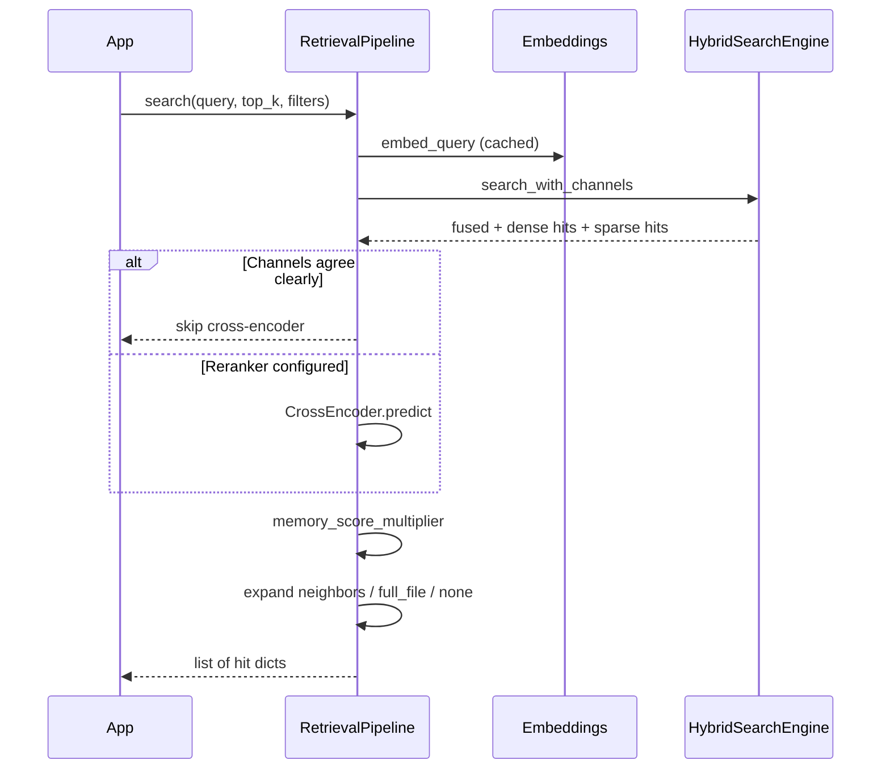

# Hybrid search

Every `memory.search()` query hits **two** indexes, then fuses ranks.

1. **Dense** — cosine / HNSW or pgvector. Matches paraphrases (“puppy” ≈ “dog”).
2. **Sparse** — BM25 in-process, or Postgres `tsvector`. Matches identifiers (`RX-78-2`, error codes).

Fusion is **Reciprocal Rank Fusion**:

```text
score(d) = Σ  1 / (fusion_k + rank(d))
```

Default `fusion_k=60` (`RetrievalConfig.fusion_k`). Implemented in `memotrix.vectorDB.hybrid.reciprocal_rank_fusion`.

## Query path



## Conditional rerank

If `reranker_model` is set **and** `enable_rerank` is true, a cross-encoder may rescore candidates. Rerank is **skipped** when the fused ranking already has a large margin, or dense and sparse agree on top-1 (`RetrievalPipeline._should_skip_rerank`).

Without a reranker model, scores are RRF (optionally multiplied by the memory boost).

## Memory boost

`memory_score_multiplier` can raise scores for recent, frequently accessed, or “important” (dedup-merged) chunks. Disable with `RetrievalConfig.enable_memory_boost=False`.

## Query embedding cache

Repeated agent queries reuse vectors (`query_cache_size`, default 256).

## Tuning

See the how-to originally in `docs/how-to/hybrid-search-tuning.md` — the same knobs:

```python
from memotrix import Memory, MemoryConfig
from memotrix.config import RetrievalConfig

config = MemoryConfig(
    retrieval=RetrievalConfig(
        top_k=5,
        fusion_k=60,
        enable_memory_boost=True,
        enable_rerank=True,
        reranker_model="cross-encoder/ms-marco-MiniLM-L-6-v2",
    )
)
```

Rerankers add latency. Only set `reranker_model` if you measured that you need it.
