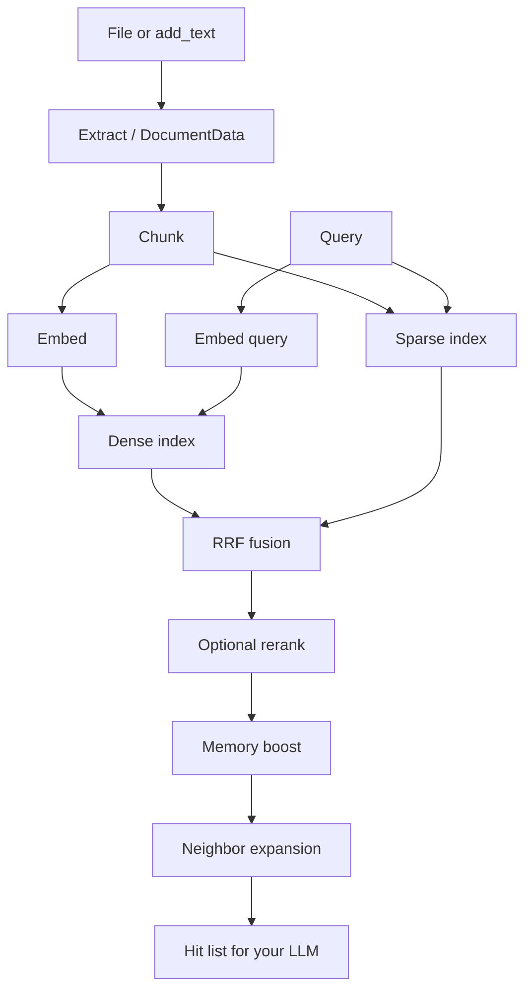

# How Memotrix works

## Simple explanation

You give Memotrix files or notes. It breaks them into small pieces, remembers the meaning of each piece (vectors) and the words in each piece (keyword index). When you ask a question, it finds the best few pieces and hands them to you. You (or your LLM) write the answer.

## Technical explanation

1. **Extract** — `extract_file` routes by extension (and JSON sniffing for FHIR / GeoJSON / chat / JSON-LD).
2. **Normalize** — extractors return `DocumentData` (`metadata`, `sections`, `text`, optional `tables` / `images`).
3. **Chunk** — `IngestionPipeline` splits text (`chunk_size` / `chunk_overlap`).
4. **Embed** — `Embeddings.embed_documents` produces dense vectors. Dimension is taken from the model, never hardcoded.
5. **Index** — dense (HNSW or pgvector) + sparse (BM25 or Postgres `tsvector`).
6. **Retrieve** — embed the query, search both indexes, fuse with Reciprocal Rank Fusion, optional cross-encoder rerank, memory-score boost, neighbor expansion.

## Internal working

The `Memory` class (`src/memotrix/memory.py`) is a facade. It wires:

- `IngestionPipeline` — chunk, dedup, write indexes, populate `DocumentStore`
- `HybridSearchEngine` — dense + sparse + RRF
- `RetrievalPipeline` — query cache, conditional rerank, expansion, access tracking

`as_stack()` returns the same internals as a dict for embedding into a larger server.

## Why it matters

Agent loops cannot dump entire documents into the prompt. Default `top_k=3` and neighbor windows keep context small while still recovering split sentences via overlap + expansion.

## Related

- [Architecture](./architecture.md)
- [Hybrid search](./hybrid-search.md)
- [Chunking](./chunking-and-expansion.md)
