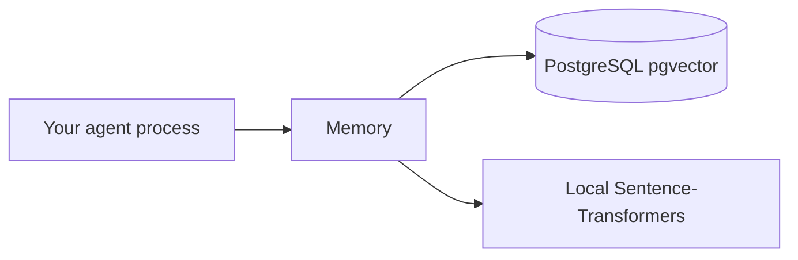

# Deployment

Memotrix is a **library** you vendor into your process (API worker, agent job, notebook).

## Typical layouts

Or fully in-process for a single worker (no Postgres): HNSW lives in RAM; do not run multiple processes that each think they own the same memories unless you use Postgres.

## Checklist

1. Python 3.10+.
2. `pip install "memotrix[postgres,memory,extractors]"` (or a smaller extra set).
3. Set `EMBEDDING_MODEL` and `DATABASE_URL` in the environment — not in git.
4. Pin the embedding model. Changing dimension requires a new Postgres table.
5. Size `max_elements` for in-memory HNSW before ingest.
6. Call `memory.close()` on shutdown when using Postgres.
7. There is no Memotrix-specific reverse proxy or SSL — terminate TLS at your app or database.

## CI

Install extras needed by tests; `pytest` extra is `dev`. This package’s tests live in the GitHub repo, not on PyPI.

## Rollback

Pin `memotrix==0.2.0` in your app. Standard pip/poetry pin; the library has no migration runner beyond `CREATE TABLE IF NOT EXISTS`.
